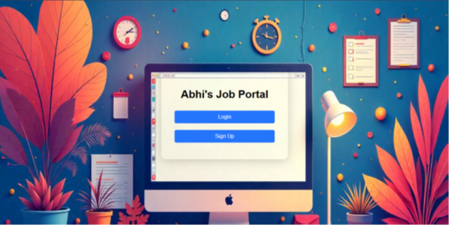
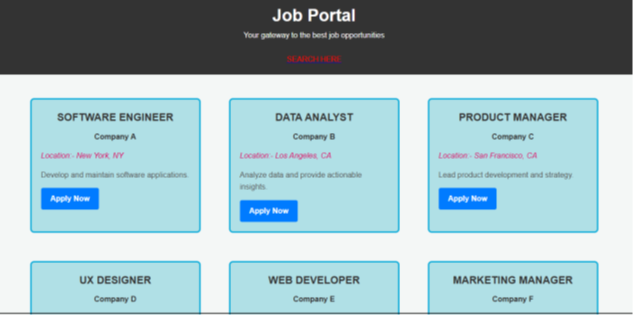
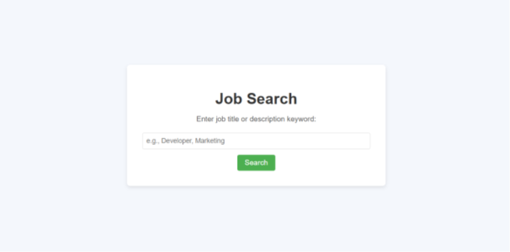
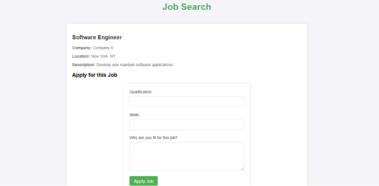
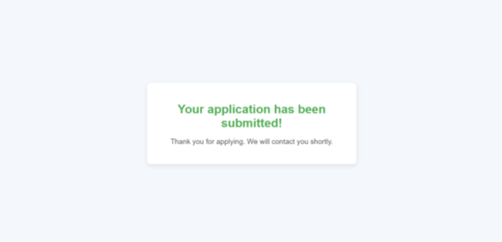
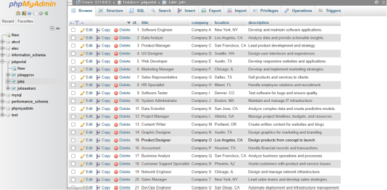

<div align="center">

# 🌐 Abhi's Job Portal

### *Your Gateway to the Best Job Opportunities*



<br/>

[](https://developer.mozilla.org/en-US/docs/Web/HTML)
[](https://developer.mozilla.org/en-US/docs/Web/CSS)
[](https://developer.mozilla.org/en-US/docs/Web/JavaScript)
[](https://www.java.com/)
[](https://www.mysql.com/)
[](https://www.apachefriends.org/)

</div>

---

## 📖 About The Project

**Abhi's Job Portal** is a full-stack web application that connects job seekers with employers. Built using **Java Servlets**, **HTML/CSS/JavaScript**, and **MySQL**, it provides a seamless experience for browsing job listings, registering as a user, and submitting job applications - all from a clean and intuitive interface.

Developed using **NetBeans IDE** with **XAMPP** as the local server environment.

---

## ✨ Features

- 🔐 **User Authentication** - Secure Login & Registration system
- 💼 **Job Listings** - Browse curated job posts with company, location & description
- 🔍 **Job Search** - Search by job title or keyword
- 📝 **Job Application** - Apply with qualifications, skills, and a personal statement
- ✅ **Submission Confirmation** - Instant feedback after applying
- 🗄️ **MySQL Database** - Persistent data storage for jobs and users

---

## 🖼️ Screenshots

<br/>

### 🏠 Welcome Page
> The landing page where users can **Login** or **Sign Up**


---

### 🔑 Login Page
> Secure login interface for registered users


---

### 📋 Register Page
> New users can register with name, username, Gmail, and password


---

### 💼 Job Listings
> Browse all available jobs with company, location, and description at a glance



---

### 🔍 Job Search
> Search for specific jobs by title or keyword



---

### 📄 Job Application Form
> Apply for a specific job by entering your qualifications, skills, and motivation



---

### ✅ Application Submitted
> Confirmation screen shown after a successful job application



---

### 🗄️ MySQL Database (phpMyAdmin)
> Backend database managing jobs, users, and applications via XAMPP



---

## 🛠️ Tech Stack

| Layer | Technology |
|---|---|
| **Frontend** | HTML5, CSS3, JavaScript |
| **Backend** | Java Servlets (Jakarta EE) |
| **Database** | MySQL |
| **Server** | Apache Tomcat (via XAMPP) |
| **IDE** | NetBeans IDE |
| **DB Admin** | phpMyAdmin |

---

## 🚀 Getting Started

### Prerequisites

Make sure you have the following installed:

- [XAMPP](https://www.apachefriends.org/) (Apache + MySQL)
- [NetBeans IDE](https://netbeans.apache.org/)
- [JDK 8+](https://www.oracle.com/java/technologies/downloads/)
- Apache Tomcat (bundled with NetBeans or standalone)

### Installation

1. **Clone the repository**
   ```bash
   git clone https://github.com/yourusername/job-portal.git
   ```

2. **Start XAMPP**
   - Launch XAMPP Control Panel
   - Start **Apache** and **MySQL** services

3. **Set up the Database**
   - Open `phpMyAdmin` → `http://localhost/phpmyadmin`
   - Create a new database called `jobportal`
   - Import the provided `jobportal.sql` file

4. **Open in NetBeans**
   - Open NetBeans IDE
   - Go to **File → Open Project** and select the cloned folder
   - Configure the Tomcat server under **Tools → Servers**

5. **Run the Project**
   - Right-click the project → **Run**
   - The app will launch in your browser at `http://localhost:8080/jobportal`

---

## 📁 Project Structure

```
job-portal/
│
├── web/
│   ├── index.html          # Welcome / Landing page
│   ├── login.html          # Login page
│   ├── register.html       # Registration page
│   ├── jobposts.html       # Job listings page
│   ├── jobsearch.html      # Job search page
│   ├── jobapply.html       # Job application form
│   ├── submission.html     # Application success page
│   ├── css/                # Stylesheets
│   └── js/                 # JavaScript files
│
├── src/
│   └── java/
│       └── servlets/       # Java Servlet files
│
├── screenshots/            # Project screenshots
│   ├── welcomepage.png
│   ├── loginpage.png
│   ├── register.png
│   ├── jobposts.png
│   ├── jobsearch.png
│   ├── jobapply.png
│   ├── submission.png
│   └── mysqldb.png
│
└── jobportal.sql           # MySQL database dump
```

---

## 🗄️ Database Schema

The MySQL database `jobportal` contains the following key tables:

- **`jobs`** — Stores job listings (title, company, location, description)
- **`jobseekers`** — Registered user accounts
- **`jobapprov`** — Job application records and statuses

---

## 🤝 Contributing

Contributions are welcome! Feel free to:

1. Fork the project
2. Create a feature branch (`git checkout -b feature/AmazingFeature`)
3. Commit your changes (`git commit -m 'Add some AmazingFeature'`)
4. Push to the branch (`git push origin feature/AmazingFeature`)
5. Open a Pull Request

---

<div align="center">

### ⭐ If you found this project helpful, please give it a star!

**Made with ❤️ by Abhi**

</div>
